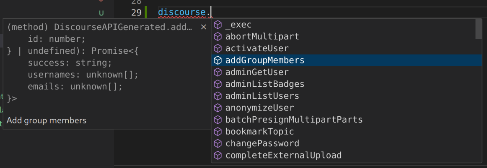
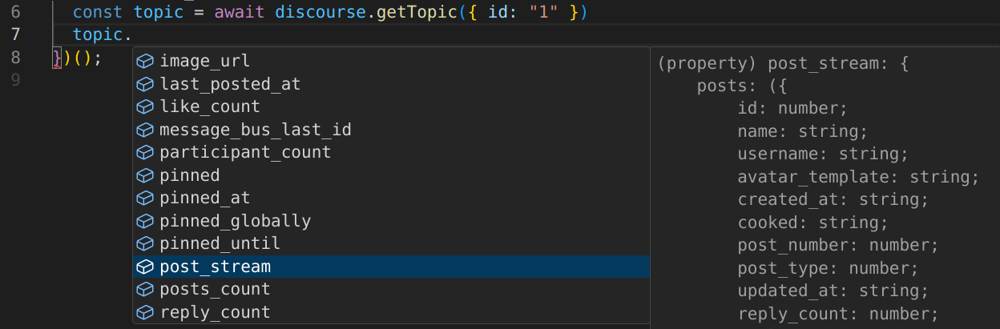

# discourse2

The complete Discourse API (strongly typed), always up-to-date.

Copyright (c) 2023 by Gadi Cohen. [MIT Licensed](./LICENSE.txt).

    [](https://github.com/semantic-release/semantic-release) [](http://www.typescriptlang.org/) [](./LICENSE)




[Live Demo on CodeSandbox](https://codesandbox.io/p/sandbox/discourse2-dht4ym).

## Features

- The _entire_ Discourse API (that’s published in the OpenAPI spec).
- _Always up-to-date_: the OpenAPI spec is checked for changes daily, and the package will automatically rebuild and publish itself on changes. The most recent retrieval is shown as a badge at the top of the README: 
- Works in both server and browser* environments (*useful for querying public
  data _without_ API keys and on relevant origin, e.g. latest topics, etc)

## Quick Start

```ts
import Discourse from "discourse2";

const discourse = new Discourse("https://forums.kiri.art", {
  "Api-Key": process.env.DISCOURSE_API_KEY,
  "Api-Username": process.env.DISCOURSE_API_USERNAME,
});

const result = await discourse.listLatestTopics();
console.log(result);
```

## APIs

We check for changes to the Discourse OpenAPI schema twice daily (at 00:20
and 12:20 UTC). You can see the most recent update on the "Discourse API"
badge at the top of this README. After such an update, we'll re-build the
package, and if all tests pass, automatically publish a new release. The
build status and latest version can also be found in badges above.

Since the API is updated automatically, **the following list may not include
all APIs available in the package**, however, at time of writing (2024-09-29),
the following APIs were supported: (link is to official docs, in same order).

- **Backups**:
  [getBackups](https://docs.discourse.org/#tag/Backups/operation/getBackups),
  [createBackup](https://docs.discourse.org/#tag/Backups/operation/createBackup),
  [sendDownloadBackupEmail](https://docs.discourse.org/#tag/Backups/operation/sendDownloadBackupEmail),
  [downloadBackup](https://docs.discourse.org/#tag/Backups/operation/downloadBackup).
- **Badges**:
  [adminListBadges](https://docs.discourse.org/#tag/Badges/operation/adminListBadges),
  [createBadge](https://docs.discourse.org/#tag/Badges/operation/createBadge),
  [updateBadge](https://docs.discourse.org/#tag/Badges/operation/updateBadge),
  [deleteBadge](https://docs.discourse.org/#tag/Badges/operation/deleteBadge).
- **Categories**:
  [createCategory](https://docs.discourse.org/#tag/Categories/operation/createCategory),
  [listCategories](https://docs.discourse.org/#tag/Categories/operation/listCategories),
  [updateCategory](https://docs.discourse.org/#tag/Categories/operation/updateCategory),
  [listCategoryTopics](https://docs.discourse.org/#tag/Categories/operation/listCategoryTopics),
  [getCategory](https://docs.discourse.org/#tag/Categories/operation/getCategory).
- **Groups**:
  [createGroup](https://docs.discourse.org/#tag/Groups/operation/createGroup)
  [deleteGroup](https://docs.discourse.org/#tag/Groups/operation/deleteGroup)
  [updateGroup](https://docs.discourse.org/#tag/Groups/operation/updateGroup)
  [getGroup](https://docs.discourse.org/#tag/Groups/operation/getGroup)
  [listGroupMembers](https://docs.discourse.org/#tag/Groups/operation/listGroupMembers)
  [addGroupMembers](https://docs.discourse.org/#tag/Groups/operation/addGroupMembers)
  [removeGroupMembers](https://docs.discourse.org/#tag/Groups/operation/removeGroupMembers)
  [listGroups](https://docs.discourse.org/#tag/Users/Groups/listGroups)
- **Invites**:
  [createInvite](https://docs.discourse.org/#tag/Invites/operation/createInvite),
  [createMultipleInvites](https://docs.discourse.org/#tag/Invites/operation/createMultipleInvites).
- **Notifications**:
  [getNotifications](https://docs.discourse.org/#tag/Notifications/operation/getNotifications),
  [markNotificationsAsRead](https://docs.discourse.org/#tag/Notifications/operation/markNotificationsAsRead).
- **Posts**:
  [listPosts](https://docs.discourse.org/#tag/Posts/operation/listPosts),
  [getPost](https://docs.discourse.org/#tag/Posts/operation/getPost),
  [updatePost](https://docs.discourse.org/#tag/Posts/operation/updatePost),
  [deletePost](https://docs.discourse.org/#tag/Posts/operation/deletePost),
  [postReplies](https://docs.discourse.org/#tag/Posts/operation/postReplies),
  [lockPost](https://docs.discourse.org/#tag/Posts/operation/lockPost),
  [performPostAction](https://docs.discourse.org/#tag/Posts/operation/performPostAction).
- **Topics**:
  [getSpecificPostsFromTopic](https://docs.discourse.org/#tag/Topics/operation/getSpecificPostsFromTopic),
  [getTopic](https://docs.discourse.org/#tag/Topics/operation/getTopic),
  [removeTopic](https://docs.discourse.org/#tag/Topics/operation/removeTopic),
  [updateTopic](https://docs.discourse.org/#tag/Topics/operation/updateTopic),
  [inviteToTopic](https://docs.discourse.org/#tag/Topics/operation/inviteToTopic),
  [bookmarkTopic](https://docs.discourse.org/#tag/Topics/operation/bookmarkTopic),
  [updateTopicStatus](https://docs.discourse.org/#tag/Topics/operation/updateTopicStatus),
  [listLatestTopics](https://docs.discourse.org/#tag/Topics/operation/listLatestTopics),
  [listTopTopics](https://docs.discourse.org/#tag/Topics/operation/listTopTopics),
  [setNotificationLevel](https://docs.discourse.org/#tag/Topics/operation/setNotificationLevel),
  [updateTopicTimestamp](https://docs.discourse.org/#tag/Topics/operation/updateTopicTimestamp),
  [createTopicTimer](https://docs.discourse.org/#tag/Topics/operation/createTopicTimer),
  [getTopicByExternalId](https://docs.discourse.org/#tag/Topics/operation/getTopicByExternalId).
- **Private Messages**:
  [createTopicPostPM](https://docs.discourse.org/#tag/Private-Messages/operation/createTopicPostPM),
  [listUserPrivateMessages](https://docs.discourse.org/#tag/Private-Messages/operation/listUserPrivateMessages),
  [getUserSentPrivateMessages](https://docs.discourse.org/#tag/Private-Messages/operation/,getUserSentPrivateMessages).
- **Search**:
  [search](https://docs.discourse.org/#tag/Search/operation/search).
- **Site**:
  [getSite](https://docs.discourse.org/#tag/Site/operation/getSite),
  [getSiteBasicInfo](https://docs.discourse.org/#tag/Site/operation/getSiteBasicInfo).
- **Tags**:
  [listTagGroups](https://docs.discourse.org/#tag/Tags/operation/listTagGroups),
  [createTagGroup](https://docs.discourse.org/#tag/Tags/operation/createTagGroup),
  [getTagGroup](https://docs.discourse.org/#tag/Tags/operation/getTagGroup),
  [updateTagGroup](https://docs.discourse.org/#tag/Tags/operation/updateTagGroup),
  [listTags](https://docs.discourse.org/#tag/Tags/operation/listTags),
  [getTag](https://docs.discourse.org/#tag/Tags/operation/getTag).
- **Uploads**:
  [createUpload](https://docs.discourse.org/#tag/Uploads/operation/createUpload),
  [generatePresignedPut](https://docs.discourse.org/#tag/Uploads/operation/generatePresignedPut),
  [completeExternalUpload](https://docs.discourse.org/#tag/Uploads/operation/completeExternalUpload),
  [createMultipartUpload](https://docs.discourse.org/#tag/Uploads/operation/createMultipartUpload),
  [batchPresignMultipartParts](https://docs.discourse.org/#tag/Uploads/operation/batchPresignMultipartParts),
  [abortMultipart](https://docs.discourse.org/#tag/Users/Uploads/abortMultipart),
  [completeMultipart](https://docs.discourse.org/#tag/Users/Uploads/completeMultipart).
- **Users**:
  [listUserBadges](https://docs.discourse.org/#tag/Users/operation/listUserBadges)
  [createUser](https://docs.discourse.org/#tag/Users/operation/createUser)
  [getUser](https://docs.discourse.org/#tag/Users/operation/getUser)
  [updateUser](https://docs.discourse.org/#tag/Users/operation/updateUser)
  [getUserExternalId](https://docs.discourse.org/#tag/Users/operation/getUserExternalId)
  [getUserIdentiyProviderExternalId](https://docs.discourse.org/#tag/Users/operation/getUserIdentiyProviderExternalId)
  [updateAvatar](https://docs.discourse.org/#tag/Users/operation/updateAvatar),
  [updateEmail](https://docs.discourse.org/#tag/Users/operation/updateEmail),
  [updateUsername](https://docs.discourse.org/#tag/Users/operation/updateUsername),
  [listUsersPublic](https://docs.discourse.org/#tag/Users/operation/listUsersPublic),
  [listUserActions](https://docs.discourse.org/#tag/Users/operation/listUserActions),
  [sendPasswordResetEmail](https://docs.discourse.org/#tag/Users/operation/sendPasswordResetEmail),
  [changePassword](https://docs.discourse.org/#tag/Users/operation/changePassword),
  [getUserEmails](https://docs.discourse.org/#tag/Users/operation/getUserEmails).
- **Admin**:
  [adminGetUser](https://docs.discourse.org/#tag/Admin/operation/adminGetUser),
  [deleteUser](https://docs.discourse.org/#tag/Admin/operation/deleteUser),
  [activateUser](https://docs.discourse.org/#tag/Admin/operation/activateUser),
  [deactivateUser](https://docs.discourse.org/#tag/Admin/operation/deactivateUser),
  [suspendUser](https://docs.discourse.org/#tag/Admin/operation/suspendUser),
  [silenceUser](https://docs.discourse.org/#tag/Admin/operation/silenceUser),
  [anonymizeUser](https://docs.discourse.org/#tag/Admin/operation/anonymizeUser),
  [logOutUser](https://docs.discourse.org/#tag/Admin/operation/logOutUser),
  [refreshGravatar](https://docs.discourse.org/#tag/Admin/operation/refreshGravatar),
  [adminListUsers](https://docs.discourse.org/#tag/Admin/operation/adminListUsers),

## Notes

1. You can discover the API through TypeScript text completion, or
   at https://docs.discourse.org/.

1. Some endpoints (like `listLatestTopics`) require auth headers in their
   OpenAPI spec, but not in practice (provided the requested resource is a
   publicly visible one). For this reason, if auth headers are required (by
   spec) but not provided, we'll try the call anyway and let the endpoint
   decide.

1. Currently, **the response is not validated**, because unfortunately,
   the returned data often does not validate against the OpenAPI schema (`additionalProperties`, missing `required` props, wrong types).

   I'm still deciding what to do with about this, feedback (in an issue)
   would be greatly appreciated. In theory I'd like to make this a
   configurable option, but if we don't validate, we really should be
   returning the data as an `unknown` type so the user performs their
   own validation, which is a pain, and you'll lose typescript completion.
   However, on the flip side, what we do now is return a type that is
   wrong, and TypeScript won't warn about missing (but now required)
   checks.

1. Installed Discourse extensions / plugins may affect the result! It
   can add additional properties, etc. Likewise, running older versions
   of Discourse may return data that doesn't match the current spec.

## TODO

- [x] Validation (params; re response, see note above)

## Development

- `yarn schema:sync` will check if the schema is up to date, and if not,
  make necessary updates and regenerations and commit the changes. If
  `CI=true`, it will also `git push` (which will trigger a rebuild and
  release).

Older method:

- ~~`yarn schema:fetch` - fetches OpenAPI schema from Discourse~~
- ~~`yarn schema:ts` - converts to TypeScript in `src/schema.d.ts`~~
- ~~`yarn generate` - generates method stubs in `src/generated.ts`~~
