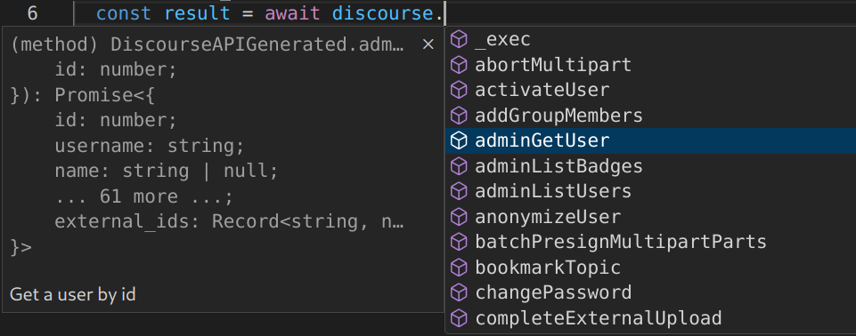

# discourse2

The complete Discourse API (strongly typed).

Copyright (c) 2023 by Gadi Cohen. [MIT Licensed](./LICENSE.txt).

   [](https://github.com/semantic-release/semantic-release) [](http://www.typescriptlang.org/) [](./LICENSE)




## Quick Start

```ts
import Discourse from "discourse2";

const discourse = new Discourse("https://forums.kiri.art", {
  "Api-Key": process.env.DISCOURSE_API_KEY,
  "Api-Username": process.env.DISCOURSE_API_USERNAME,
});

const result = await discourse.listLatestTopics();
console.log(result);
```

## Notes

1. You can discover the API through TypeScript text completion, or
   at https://docs.discourse.org/.

1. Some endpoints (like `listLatestTopics`) require auth headers in their
   OpenAPI spec, but not in practice (provided the requested resource is a
   publicly visible one). For this reason, if auth headers are required (by
   spec) but not provided, we'll try the call anyway and let the endpoint
   decide.

## TODO

- [ ] Validation

## Development

- `yarn schema:fetch` - fetches OpenAPI schema from Discourse
- `yarn schema:ts` - converts to TypeScript in `src/schema.d.ts`
- `yarn generate` - generates method stubs in `src/generated.ts`
